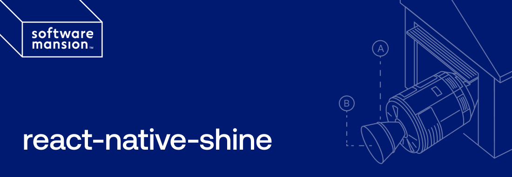

Fast and efficient way to add interactive GPU-based shader effects to your React Native apps using [TypeGPU](https://github.com/software-mansion/TypeGPU) and [WebGPU](https://github.com/wcandillon/react-native-webgpu).

`react-native-shine` leverages powerful GPU execution via native bindings, delivering lovely, fancy and **shiny** effects—ideal for UIs or creative interactions.

---

## ⚙️ Installation

Install the library:

```sh
yarn add react-native-shine
# or
npm install react-native-shine
```

---

### 📦 Install Required Peer Dependencies

This library depends on several native modules that must be installed in your host app.

Install required peer dependencies with:

```sh
yarn add react-native-reanimated react-native-worklets react-native-wgpu typegpu
# or
npm install react-native-reanimated react-native-worklets react-native-wgpu typegpu
```

These are not bundled with the library and must match compatible versions used by your app.

---

### 🛠️ Optional: Auto-install Peer Dependencies

You can also use our helper script to install all peer deps automatically:

```sh
yarn run install-peers
```

Or use `install-peerdeps`:

```sh
npx install-peerdeps react-native-shine
```

> Note: `install-peerdeps` reads the `peerDependencies` section of the package and installs them at the root level of your project.

---

## 📋 Requirements

- React Native ≥ 0.71
- `react-native-reanimated` ≥ 4.0.0
- `react-native-webgpu` ≥ 0.2.0
- `typegpu` ~= 0.7.1
- WebGPU-compatible device/emulator

> [!NOTE]
> If you’re using Expo, you’ll need to use the bare workflow (custom dev client or prebuild) to support native modules.

---

## 🚀 Usage

Basic example:

```tsx
import { View } from 'react-native';
import { Shine } from 'react-native-shine';

export default function Index() {
  return (
    <View
      style={{
        flex: 1,
        justifyContent: 'center',
        alignItems: 'center',
      }}
    >
      <Shine
        imageURI="https://example.com/card_image.png"
        width={300}
        height={400}
      />
    </View>
  );
}
```

For more thorough usage examples and docs click [here](https://github.com/software-mansion-labs/react-native-shine/blob/main/USAGE.md)

---

## 🧪 Troubleshooting

If you encounter runtime or build issues:

- Make sure all peer dependencies are installed.
- Rebuild your app after installing native modules:

  ```sh
  # iOS
  cd ios && xcodebuild clean && cd ..
  npx react-native run-ios

  # Android
  cd android && ./gradlew clean && cd ..
  npx react-native run-android
  ```

  ```sh
  # Expo

  # iOS
  npx expo prebuild
  npx expo run:ios

  # Android
  npx expo prebuild
  npx expo run:android
  ```

- Clear bundler cache (helps with Metro native linking issues).

---

## 🧑‍💻 Contributing

Want to help improve `react-native-shine`?

Check out the [`CONTRIBUTING.md`](CONTRIBUTING.md) guide for instructions on how to build, test, and submit PRs.

We welcome shaders, GPU visual effects, demos, and bug fixes!

---

## Shine is created by Software Mansion

[](https://swmansion.com)

Since 2012 [Software Mansion](https://swmansion.com) is a software agency with
experience in building web and mobile apps. We are Core React Native
Contributors and experts in dealing with all kinds of React Native issues. We
can help you build your next dream product –
[Hire us](https://swmansion.com/contact/projects?utm_source=shine&utm_medium=readme).

<!-- automd:contributors author="software-mansion" -->

Made by [@software-mansion](https://github.com/software-mansion) and
[community](https://github.com/software-mansion-labs/react-native-shine/graphs/contributors) 💛
<br><br>
<a href="https://github.com/software-mansion-labs/react-native-shine/graphs/contributors">

</a>

<!-- /automd -->
